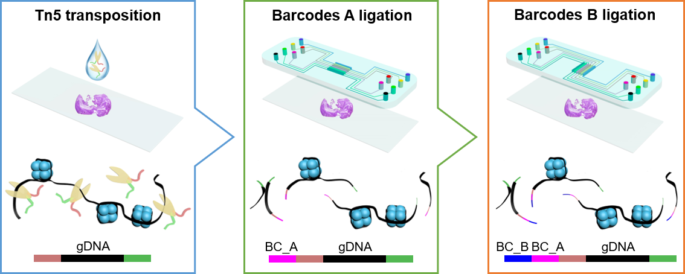

# Spatial-ATAC-seq: spatially resolved chromatin accessibility profiling of tissue at genome scale and cellular level




## Data processing

Next Generation Sequencing (NGS) was performed using the Illumina HiSeq 4000 sequencer (pair-end 150 bp mode). 

### 1. Raw Fastq data

Read 1: contains the spatial Barcode A and Barcode B

Read 2: contains the genome sequences

### 2. Reformat raw Fastq file to Cell Ranger ATAC format (10x Genomics)

**Raw read 1 -> New Read 1 + New Read 2**

- New Read 1: contains the genome sequences

- New Read 2: contains the spatial Barcode A and Barcode B

**Raw read 2 -> New Read 3**

Reformatting raw data was implemented by BC_process.py in the Data_preprocessing folder.

### 3. Sequence alignment and generation of fragments file

The reformated data was processed using Cell Ranger ATAC v1.2 with following references:

Mouse reference (mm10):
```
curl -O https://cf.10xgenomics.com/supp/cell-atac/refdata-cellranger-atac-mm10-1.2.0.tar.gz
```

Human reference (GRCh38):
```
curl -O https://cf.10xgenomics.com/supp/cell-atac/refdata-cellranger-atac-GRCh38-1.2.0.tar.gz
```

**A preprocessing pipeline we developed using Snakemake workflow management system is in the Data_preprocessing folder. To run the pipeline, use the command:**
```
sbatch Snakemake.sh
```

## Data visualization

The data visualization were implemented with ArchR v1.0.1 and Seurat v3.2 package (Data_visualization folder).

Brief descriptions of analysis scripts:

**metadata_files_for_Seurat_spatial.ipynb**: Generate metadata files that were compatible with Seurat workflow for spatial datasets.

**archR.R**: Data normalization and dimensionality reduction, identifying the marker genes, peak calling, deviatons enrichment anaylsis, and bulk sample projection.

**spatial_data_visualization.R**: Visualize spatially resolved data on tissue sections.

**GO_enrichment_analysis.R**: GO enrichment analysis for marker genes.

**integrative_data_analysis.R**: Integrative data analysis with scRNA-seq reference datasets.
